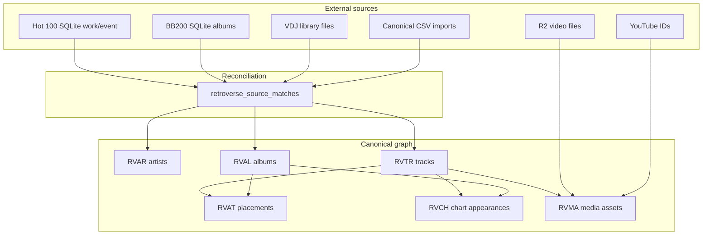

# Retroverse relationship & matching audit

**Date:** 2026-05-17  
**Scope:** Discovery only — no new UI, no redesign.  
**Goal:** Map what already exists before rebuilding canonical track identity (RVTR).

---

## Executive summary

| Layer | Authoritative today | Gap |
|-------|---------------------|-----|
| **Canonical IDs (RVAR/RVAL/RVTR)** | Supabase `retroverse_*` graph | Hot 100 / VDJ / playback not fully wired to RVTR |
| **Hot 100 chart history** | SQLite `billboard-hot-100.db` (`event` / `work`) | Uses `work_id` (W#####), not RVTR |
| **Billboard 200 album charts** | SQLite `albums` + derived Supabase `canonical_album_chart_runs` | Track-level BB200 not primary |
| **VDJ file linkage** | Schema exists (`vdj_asset`, `work_asset_link`) | **0 rows** in local DB; seed-only in Supabase |
| **Playback / R2 video** | Legacy `Sites/retroverse/apps/music-browser` + `video_lookup.json` | **Not ported** to `retroverse-welcome` |
| **Album artwork** | Supabase `retroverse_album_artwork` + R2 | Mature curator exists; track curator does not |
| **Track matching** | Scripts + `retroverse_source_matches` | No product UI for merge/split/approve |

**True backbone for cultural entities:** Supabase canonical graph + `retroverse_source_matches` reconciliation table.  
**True backbone for chart ops (today):** Hot 100 SQLite graph (parallel identity space).  
**Historical playback stack:** `music-browser` (outside RETROVERSE_v2).

---

## 1. Entity map (canonical vs operational)

```
                    ┌─────────────────────────────────────────┐
                    │         SUPABASE (canonical graph)       │
                    │  RVAR ──< RVAL ──< RVED ──< RVAT >── RVTR │
                    │    │       │                    │      │
                    │    │       └── RVAW (covers)     │      │
                    │    │       └── RVRL (credits)     │      │
                    │    └──────────────────────────────┘      │
                    │  RVSM (source, key) ──> RVAR|RVAL|RVTR   │
                    │  RVCH (chart facts) ──> RVTR and/or RVAL │
                    │  RVMA (media files) ──> RVTR only         │
                    │  RVEN (acoustic enrichment) ──? RVTR      │
                    └─────────────────────────────────────────┘
                                      ▲
                          import / backfill scripts
                                      │
        ┌─────────────────────────────┴─────────────────────────────┐
        │                                                             │
┌───────┴────────┐                              ┌──────────────────┴──────────┐
│ SQLite Hot 100   │                              │ SQLite Billboard 200         │
│ person, work     │                              │ albums (weekly rows)         │
│ event, event_entry│                             │ acoustic_features (per song) │
│ vdj_asset (empty)│                              │                              │
│ work_asset_link  │                              │                              │
└──────────────────┘                              └──────────────────────────────┘

LEGACY (Sites/retroverse, not v2):
  video_lookup.json + vdj_library_run ──> R2 URLs (media.retroverse.live)
  music-browser playback resolver (R2 → YouTube → search)
```

### ID prefixes (implemented in Supabase)

| Prefix | Entity | Table |
|--------|--------|-------|
| RVAR | Artist | `retroverse_artists` |
| RVAL | Album | `retroverse_albums` |
| RVTR | **Track** | `retroverse_tracks` |
| RVED | Edition | `retroverse_album_editions` |
| RVAT | Album placement | `retroverse_album_tracks` |
| RVCH | Chart row | `retroverse_chart_appearances` |
| RVMA | Media asset | `retroverse_media_assets` |
| RVSM | External match | `retroverse_source_matches` |
| RVEN | Acoustic row | `retroverse_track_enrichment` |
| RVWK | Week index | `retroverse_weeks` |

**Reuse rule (schema intent):** One `RVTR` per logical recording; many `RVAT` rows = appearances (compilations, soundtracks, editions). Variants (live, remaster, duet) should be **linked instances**, not duplicate RVTRs — enforcement is partial (scripts + manual).

---

## 2. SQLite database inventory

**Primary folder:** `/Users/bobhopp/RETROVERSE_DATA/databases/`

| Database | Tables | Row scale (approx) | Role |
|----------|--------|-------------------|------|
| `billboard-hot-100.db` | `person`, `work`, `event`, `event_entry`, `charts`, `chart_issues`, `chart_positions`, `vdj_asset`, `work_asset_link` | 351k chart entries, 32k works | Hot 100 week spine + **intended** VDJ bridge |
| `billboard-200-albums-charts.db` | `albums`, `acoustic_features` | 574k album rows, 340k acoustic | BB200 weekly + Spotify-style features |
| `retroverse-master.db` | Same graph shape as Hot 100 | **0 rows** | Empty shell; do not use |

**Mirrors (duplicates):** `Sites/retroverse/data/raw/charts/`, `Sites/retroverse-data/databases/`

**Env overrides (welcome app):** `HOT100_SQLITE_PATH`, `BILLBOARD200_SQLITE_PATH`

### Hot 100 SQLite relationships

```
person (P#####)
   ↑
work (W#####) ──work_key_text (title_norm—artist_norm)
   ↑
event_entry ──> event (per week, RVA-HOT100, issue_date)
   │
   └── rank, last_week, peak_pos, weeks_on_chart

work_asset_link (empty) ──> vdj_asset (empty)
   work_id                    asset_id, file_path
```

### Billboard 200 SQLite

- **`albums`:** denormalized `(date, artist, album, rank)` — no RVTR/RVAL.
- **`acoustic_features`:** keyed by Spotify-style `id`; join to charts by normalized strings, not FK.

---

## 3. Supabase table inventory (relationship-focused)

### Core spine

| Table | Relationships |
|-------|----------------|
| `retroverse_artists` | Parent of albums, tracks, roles |
| `retroverse_albums` | FK → artist, era; children: editions, tracks (via RVAT), artwork, roles |
| `retroverse_tracks` | FK → artist; optional default album, era |
| `retroverse_album_editions` | FK → album; one `is_primary` per album |
| `retroverse_album_tracks` | FK → edition + **RVTR**; disc/track/side (placement only) |
| `retroverse_album_artist_roles` | FK → album + artist (credits) |
| `retroverse_album_artwork` | FK → album/edition; `canonical_cover_path` |

### Reconciliation & charts

| Table | Relationships |
|-------|----------------|
| `retroverse_source_matches` | **Polymorphic:** `(source, source_key)` → RVAR/RVAL/RVTR/RVCH/RVER; **no FK** to entity table |
| `retroverse_chart_appearances` | FK → RVTR (optional) and/or RVAL; raw chart warehouse |
| `canonical_album_chart_runs` | Derived: one row per `(RVAL, chart_date)`; FK `rvwk_sequence` → `retroverse_weeks` |
| `canonical_album_chart_conflicts` | Audit queue for spine issues |
| `canonical_album_chart_week_counts` | View: week count per album |

### Media & enrichment

| Table | Relationships |
|-------|----------------|
| `retroverse_media_assets` | FK → **RVTR**; `local_path`, `media_source` (playback files) |
| `retroverse_track_enrichment` | Optional FK → RVTR; unique `source_fingerprint` (acoustic SQLite) |

**Migrations:** `supabase/migrations/20260506195500_*` through `20260514100000_*`  
**Docs:** `docs/retroverse_schema_overview.md`, `docs/retroverse_track_graph_plan.md`, `docs/retroverse_schema.dbml`

---

## 4. Matching & canonicalization systems

### 4.1 Authoritative matching table (Supabase)

**`retroverse_source_matches`** — the designed reconciliation layer.

- Unique: `(source, source_key, retroverse_entity_type)`
- Examples from seed: `source=billboard`, `hot-100:1978-02-04:stayin-alive` → RVTR; `source=virtualdj`, `vdj:file:…` → RVTR
- Used by: Billboard 200 import, chart backfill, iTunes fill scope, inventory scripts

### 4.2 Track ID minting (deterministic)

| Location | Key rule |
|----------|----------|
| `scripts/backfill_wave1_tracklists.ts` | `trackKey = normalize(title)::retroverse_artist_id` → `allocateId("RVTR", …)` |
| `scripts/import_canonical_album_csv.ts` | `canonicalTrackKey` + hash allocator |
| `lib/canonical-acoustic-aggregate.ts` | `allocateRetroverseTrackId` (dossier-side proposals) |
| `scripts/match_acoustic_enrichment.ts` | Link RVEN rows → RVTR: exact artist+title, album disambiguation; confidence thresholds |

### 4.3 Album / artist matching

| Location | Role |
|----------|------|
| `scripts/import_billboard200_albums.ts` | `albumIdentityKey`, `normalizeText` → RVAL + RVSM |
| `scripts/lib/billboard200-historical.ts` | Synthetic title filters, slug keys |
| `scripts/reconcile_legacy_cover_archive.ts` | Fuzzy A/B/C/D tier cover matching (artwork, not tracks) |
| `lib/artwork-resolver-identity.ts` | Album kind + title normalization for search |

### 4.4 Hot 100 SQLite matching (parallel universe)

- Identity = **`work_id`** + `work_key_text`, not RVTR
- VDJ bridge: `work_asset_link` (`confidence`, `confidence_band`, `match_method`) — **schema only, no data**
- Track Deck ownership: `lib/track-deck/ownership.ts` reads this bridge

### 4.5 Planned but not implemented (from track graph plan)

- `inventory_track_sources`
- `propose_track_reconciliation` / `apply_track_reconciliation`
- Product **track curator** UI

---

## 5. VDJ integration inventory

| System | Location | Status |
|--------|----------|--------|
| SQLite `vdj_asset` / `work_asset_link` | `billboard-hot-100.db` | Empty |
| Supabase `retroverse_source_matches` (`virtualdj`) | seed.sql | Pilot examples only |
| Supabase `retroverse_media_assets` | migration | Schema; sparse population |
| VDJ library ingest | `Sites/retroverse/scripts/build_master_dataset.ts` | Merges `vdj_library_run_*.json` |
| Play count map | `music-browser/lib/vdj-play-count-map.ts` | From video-index JSON |
| Playlist export | `music-browser/lib/playlist-export.ts` | `artist - title` lines for VDJ |
| Track Deck | `lib/track-deck/*` | Copy path / YouTube; no launch |
| ChartTube ingest | `Sites/ChartTube/scripts/build_videolibrary_from_xml_v3.py` | Parses `database.xml` |

**No `vdj://` or shell-open launch** found in RETROVERSE_v2.

---

## 6. Playback & R2 media inventory

### 6.1 Legacy (worked historically) — `Sites/retroverse`

| Component | Path | Behavior |
|-----------|------|----------|
| Playback resolver | `apps/music-browser/lib/playback.ts` | R2 → YouTube → search |
| Play button state | `lib/track-play-button-state.ts` | `local` / `youtube` / `search`, `isPlaying` |
| Hot 100 week UI | `app/charts/week/[date]/page.tsx` | Chart rows + in-app YouTube dock |
| R2 URL map | `apps/charts_app/data/video_lookup.json` | slug → `r2_url` |
| Video cache server | `lib/video-cache-server.ts` | Merges lookup + VDJ index (**API may be stubbed**) |
| Web player | `apps/web/src/components/VideoPlayerModal.tsx` | HTML5 `<video>` on R2 URL |
| Public base | `https://media.retroverse.live` | CDN for video |

### 6.2 Current RETROVERSE_v2 (`retroverse-welcome`)

| Component | Path | Behavior |
|-----------|------|----------|
| Album covers | `lib/canonical-cover-url.ts` | `RETROVERSE_COVER_BASE_URL` + `retroverse/covers/RVAL…` |
| R2 upload | `lib/r2-client.ts` | Curator writes |
| Track Deck | `lib/track-deck/actions.ts` | YouTube search only |
| Dossier PLAY | `album-dossier-operator-overlay.tsx` | Copy only |
| `retroverse_media_assets` | Supabase | Intended RVTR playback; not wired in welcome UI |

---

## 7. Ownership state (today)

| Surface | Logic | Authority |
|---------|-------|-----------|
| Track Deck | `missing` / `owned` / `linked` / `partial` / `unmatched` from SQLite link counts | `work_asset_link` (empty → all missing) |
| Album artwork | `lib/artwork-living-archive.ts` | Provisional/canonical artwork states |
| Source match | `confidence_score`, `manual_override` on RVSM | Supabase |

**No unified “track ownership” in Supabase yet** beyond RVSM + RVMA schema.

---

## 8. Data flow diagrams

### 8.1 Intended target flow (RVTR-centric)



### 8.2 Actual flow today (split brain)

```mermaid
flowchart LR
  subgraph sqlite [SQLite local]
    W[work W#####]
    E[event_entry]
    VDJ_T[vdj_asset EMPTY]
  end

  subgraph supa [Supabase]
    RVTR2[RVTR######]
    RVSM2[RVSM]
    RVAL2[RVAL######]
  end

  subgraph ui [retroverse-welcome UI]
    TD[Track Deck]
    RS[RetroScope]
    AD[Album dossier]
  end

  subgraph legacy [music-browser legacy]
    VL[video_lookup.json]
    PLAY[playback.ts]
  end

  E --> TD
  W --> TD
  VDJ_T -.-> TD
  RVSM2 --> RVAL2
  RVSM2 -.-> RVTR2
  RVAL2 --> RS
  RVAL2 --> AD
  VL --> PLAY
  PLAY -.x TD
```

---

## 9. Currently authoritative vs legacy/duplicate

### Authoritative (use these)

| Concern | System |
|---------|--------|
| Canonical artist/album/track IDs | Supabase `retroverse_*` |
| External key → canonical ID | `retroverse_source_matches` |
| Album chart timeline (product) | `canonical_album_chart_runs` + `retroverse_weeks` |
| Hot 100 week browsing (ops) | SQLite `event` / `event_entry` / `work` |
| Album cover paths | `retroverse_album_artwork.canonical_cover_path` + R2 |
| Track graph docs | `docs/retroverse_track_graph_plan.md` |

### Legacy / duplicate (do not extend blindly)

| System | Why duplicate |
|--------|----------------|
| `chart_positions` (100 rows) in Hot 100 DB | Sample; real spine is `event_entry` |
| `retroverse-master.db` | Empty duplicate schema |
| `music-browser` + `charts_app` | Full playback; parallel to welcome |
| `video_lookup.json` keying | `artist__title` slugs, not RVTR |
| Hot 100 `work_id` | Parallel identity to RVTR |
| Track Retroscope stub | Album corpus disguised as tracks |
| Multiple BB200 SQLite copies | Same hash, different paths |

### Competing chart warehouses

| Store | Grain | Anchored to |
|-------|-------|-------------|
| SQLite `event_entry` | Hot 100 week/rank | `work_id` |
| Supabase `retroverse_chart_appearances` | Generic chart row | RVTR and/or RVAL |
| Supabase `canonical_album_chart_runs` | BB200 week/album | RVAL only |

**Hot 100 → RVTR chart linkage is not fully backfilled** (plan doc acknowledges).

---

## 10. Candidate canonical track architecture

This is **descriptive** of what the schema already implies — not a new design.

### One RVTR, many linked instances

| Instance type | Where it should live | Today |
|---------------|---------------------|-------|
| Studio / album placement | `retroverse_album_tracks` + edition | Implemented |
| Chart appearance | `retroverse_chart_appearances` | Partial (BB200 album-heavy) |
| Hot 100 week row | Should be RVSM or RVCH → RVTR | Still on `work_id` |
| VDJ file | `retroverse_media_assets` or RVSM `virtualdj` | Schema only |
| R2 video | RVMA + `media_source` | Legacy JSON map |
| Acoustic fingerprint | `retroverse_track_enrichment` | Import + `match_acoustic_enrichment.ts` |
| Live / remaster / duet variant | Same RVTR vs child RVTR? | **Policy unclear** — needs curator rules |

### Track Curator (future) — mirror artwork curator

Existing artwork pattern to copy:

- `/internal/curator`, `/portal-v2/curate`
- `retroverse_source_matches.manual_override`
- Living archive states in `lib/artwork-living-archive.ts`

Track curator would need:

- Inspect RVTR + all RVSM / RVAT / RVCH / RVMA
- Merge/split RVTR (with RVSM rewiring)
- Approve fuzzy matches (`confidence_score`)
- Attach Hot 100 `work_id` → RVTR mapping
- Attach VDJ path → RVMA or RVSM
- Attach chart entries

---

## 11. File index (high-signal)

### Supabase / docs

- `supabase/migrations/20260506195500_retroverse_canonical_graph.sql`
- `supabase/migrations/20260510140000_chart_appearances_album_optional_track.sql`
- `supabase/migrations/20260513120000_canonical_album_chart_runs.sql`
- `docs/retroverse_track_graph_plan.md`

### Matching scripts

- `scripts/backfill_wave1_tracklists.ts`
- `scripts/match_acoustic_enrichment.ts`
- `scripts/import_billboard200_albums.ts`
- `scripts/backfill_billboard200_chart_appearances.ts`

### Graph consumers (read-only)

- `lib/retroverse-lineage.ts`
- `lib/retroverse-pathways.ts`
- `app/tracks/[id]/page.tsx`

### Ops surfaces

- `app/track-deck/*` — Hot 100 + VDJ gap scan (SQLite)
- `app/chart-inspector/*` — album chart runs (Supabase)
- `app/internal/curator/*` — **album artwork** only

### Legacy playback (Sites/retroverse)

- `apps/music-browser/lib/playback.ts`
- `apps/music-browser/lib/track-play-button-state.ts`
- `apps/charts_app/data/video_lookup.json`

---

## 12. Recommended stabilization order (no new architecture)

1. **Declare authority:** Supabase RVTR + RVSM for identity; SQLite for raw Hot 100 ingest only.
2. **Backfill Hot 100 → RVSM/RVCH** using `work_id` / `work_key_text` + MBID where present (scripting, not UI).
3. **Populate VDJ bridge** into `vdj_asset` / `work_asset_link` OR directly into RVSM/RVMA from existing `vdj_library_run` JSON.
4. **Port playback resolver** from `music-browser` keyed by RVTR (or RVSM `source_key`) instead of orphan slugs.
5. **Track Curator v1** — read-only inspector over RVTR graph + pending matches (clone curator patterns).
6. **Deprecate** parallel identities in UI (work_id-only Track Deck should show RVTR when matched).

---

## 13. Answer: “Don’t Let the Sun Go Down on Me”

To resolve to **one** canonical entity:

1. One **RVTR** row in `retroverse_tracks` (e.g. canonical title + primary `RVAR` for Elton John).
2. Multiple **RVAT** rows for album placements (studio, compilations).
3. Multiple **RVCH** rows for Hot 100 / other chart weeks.
4. Multiple **RVSM** rows: `billboard:hot-100:…`, `virtualdj:file:…`, Spotify ids, etc.
5. Multiple **RVMA** rows: R2 mp4, YouTube convention, local path.
6. **RVAT** on George Michael duet album = same RVTR or separate RVTR? → **curator policy required** (merge vs feat. artist variant).

Nothing in the current welcome app unifies that song end-to-end; the **schema supports it**; **reconciliation coverage** does not.

---

*End of audit.*
